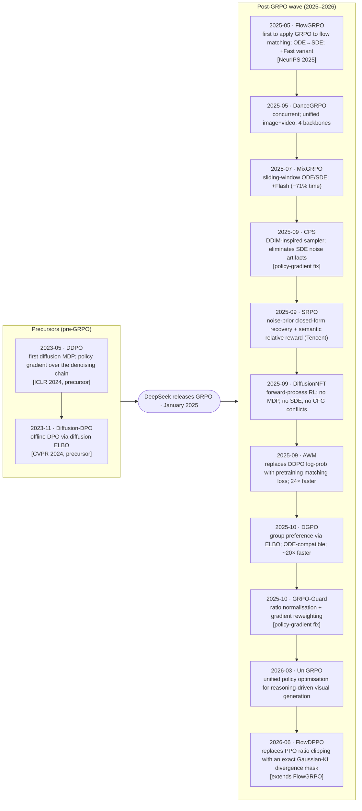

# Diffusion-RL Survey

Reinforcement learning has quietly become the default way to *steer* image and video
generators. Once a diffusion or flow model can draw, the interesting question stops being
"can it render?" and becomes "can we make it render what we actually want" — on instruction,
in composition, to taste. Since early 2025 a fast-moving line of work has answered that by
porting the RL machinery behind aligned language models onto continuous generative models.

This survey follows that line paper by paper: where each method came from, the one problem it
set out to solve, and how it connects to what came before and after. You can read it front to
back like a study notebook, or drop in on a single algorithm.

**New to the area?** Three threads run underneath everything here. You don't need them cold —
each has a short, scoped primer under [`papers/prerequisites/`](papers/prerequisites/multimodal_basics.md):

- **Multimodal generative models** — how text-to-image/video architectures are built and trained ([primer](papers/prerequisites/multimodal_basics.md))
- **Flow matching & diffusion** — DDPM, DDIM, rectified flow ([primer](papers/prerequisites/flow_matching_basics.md))
- **GRPO / PPO** — the RL recipe being transplanted from LLMs ([primer](papers/prerequisites/grpo_basics.md))

The papers themselves concentrate on the genuinely hard part: what breaks when these RL ideas
move from discrete text to continuous pixels, and the distinct way each method patches it.

Throughout, the algorithms are organized the way the **VeRL-Omni** training framework organizes
them — by *training objective*, into **Policy Gradient** and **Direct Preference** families.
Grouping the survey and the framework the same way keeps the distance from "I understand this
method" to "I can run it" short.

---

## Repository Layout

```
diffusion-rl-survey/
├── README.md                     ← you are here
├── INTEGRATION_GUIDE.md          ← how to add new algorithms (format rules, notation, checklist)
├── models.md                     ← industry models using multimodal RL (2025–2026)
└── papers/
    ├── INDEX.md                  ← master table: all papers, dates, arXiv links, citation map
    ├── READING_GUIDE.md          ← how one approach leads to the next; recommended paths
    ├── academia.md               ← 20+ additional papers from late 2025–2026
    ├── prerequisites/            ← primers: GRPO basics, flow matching basics
    ├── policy_gradient/          ← PPO-clip policy gradient over the trajectory (FlowGRPO family)
    │   ├── flow_grpo.md          ← FlowGRPO (May 2025, NeurIPS 2025) — pioneering GRPO for flow matching
    │   ├── dance_grpo.md         ← DanceGRPO (May 2025) — concurrent; unified image+video
    │   ├── mix_grpo.md           ← MixGRPO + Flash variant (Jul 2025)
    │   ├── cps.md                ← FlowGRPO-CPS — noise-artifact fix (Sep 2025)
    │   ├── grpo_guard.md         ← GRPO-Guard — anti-reward-hacking (Oct 2025)
    │   ├── uni_grpo.md           ← UniGRPO — reasoning-driven generation (Mar 2026)
    │   └── flow_dppo.md          ← FlowDPPO — exact-KL divergence mask vs PPO clip (Jun 2026)
    └── direct_preference/        ← preference / MSE loss on final samples (solver-agnostic)
        ├── diffusion_dpo.md      ← Diffusion-DPO (Nov 2023, CVPR 2024) — root of the family; ELBO preference
        ├── srpo.md               ← SRPO (Sep 2025) — noise-prior recovery + semantic relative reward
        ├── diffusion_nft.md      ← DiffusionNFT — forward-process RL (Sep 2025)
        ├── awm.md                ← AWM — advantage-weighted matching loss (Sep 2025)
        └── dgpo.md               ← DGPO — group preference, ODE-compatible (Oct 2025)
```

---

## Core Paradigm Split

The central conceptual divide in this field is the **training objective**:

### Policy Gradient paradigm

The objective is a **PPO-clip / importance-weighted policy gradient accumulated over multiple denoising timesteps of the same trajectory** (the FlowGRPO family). Computing it requires a tractable per-step log-probability $\log \pi_\theta(x_{t-1}\mid x_t)$, which in turn requires a stochastic (SDE) sampler so that a density exists — an *implication* of the objective, not its definition.

| What it means in practice | Consequence |
|---|---|
| Importance ratio $\rho = \pi_\theta / \pi_{\theta_\text{old}}$ needed at each step | Forces an SDE sampler; sensitive to ratio imbalance across timesteps |
| Gradient flows through (a window of) reverse steps | Slower / more memory-intensive than ODE inference |

Methods: **FlowGRPO, DanceGRPO, MixGRPO, FlowDPPO** (and fixes: FlowGRPO-CPS, GRPO-Guard); UniGRPO extends it to joint text+image.

### Direct Preference paradigm

The objective is a **preference or MSE-style loss evaluated on final (or single) samples** — preference, contrastive matching, or advantage-weighted matching — with **no per-step importance ratio**. This makes the methods inherently **solver-agnostic**: any ODE/DDIM/DPM solver can generate trajectories without changing the loss.

| What it means in practice | Consequence |
|---|---|
| Can use fast ODE/DDIM samplers during training | Much faster data collection |
| No per-step importance ratio | No ratio-imbalance failure mode |
| Works with black-box solvers and CFG | More compatible with production pipelines |

Methods: **Diffusion-DPO, DGPO, DiffusionNFT, AWM, SRPO**

---

## Conceptual Taxonomy

### By training objective

| Objective type | Family | Papers |
|---|---|---|
| **Policy gradient, PPO-clipped** | Policy Gradient | FlowGRPO, DanceGRPO, MixGRPO, FlowDPPO |
| **Group preference (DPO-style ELBO)** | Direct Preference | Diffusion-DPO, DGPO |
| **Advantage-weighted matching loss** | Direct Preference | AWM |
| **Contrastive forward-process** | Direct Preference | DiffusionNFT |
| **Direct reward + semantic relative reward** | Direct Preference | SRPO |

### By efficiency problem solved

| Problem | Solutions |
|---|---|
| Flow matching ODE has no density → GRPO undefined | FlowGRPO (ODE→SDE conversion) |
| All $T$ SDE steps need gradients → slow | FlowGRPO-Fast, MixGRPO, MixGRPO-Flash |
| SDE noise artifacts hurt reward learning | FlowGRPO-CPS |
| Ratio imbalance → reward hacking | GRPO-Guard |
| SDE requirement blocks fast ODE samplers | DGPO, AWM, DiffusionNFT |
| Pretraining objective diverges from RL objective | AWM |
| Reverse-process CFG conflicts | DiffusionNFT |
| Offline alignment (no online rollouts) | Diffusion-DPO |

---

## Development Timeline



See `papers/academia.md` for 20+ additional algorithm papers from late 2025–2026 (BranchGRPO, TreeGRPO, DenseGRPO, DiverseGRPO, DRIFT, TDM-R1, and more).

See `papers/INDEX.md` for the full citation graph.

---

## Recommended Reading Order

See **[`papers/READING_GUIDE.md`](papers/READING_GUIDE.md)** for the full narrative with explanations of how each paper leads to the next.

Quick paths:
- **Core chain** (how FlowGRPO is iteratively improved): `flow_grpo → mix_grpo → grpo_guard → cps`
- **Direct Preference branch** (alternatives that drop the SDE requirement): `flow_grpo → awm → dgpo → srpo`
- **Concurrent breadth**: `dance_grpo` alongside either path above
